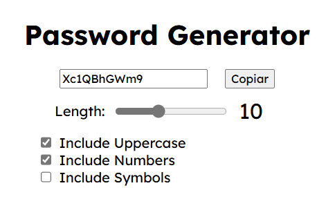

# Password Generator

This project was generated with [Angular CLI](https://github.com/angular/angular-cli) version 18.2.5 and is one of the micro projects of an Angular learning series.

## Project

A simple component that generates random passwords and accepts three parameters: uppercase characters, numbers and symbols. 

## Future improvements

- [ ] Change the notification style. The idea is to create a modern and minimalistic toast like the following:

